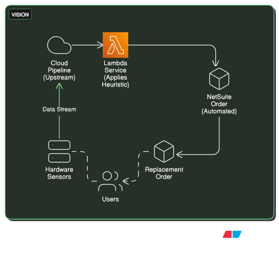
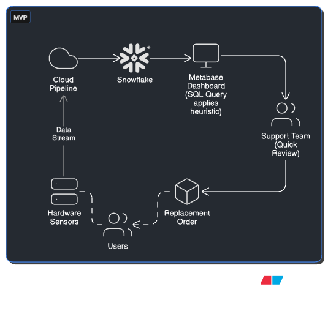

# Proactive Device Monitoring

Shifting from reactive to proactive failure detection

<!--
Speaker Notes:
Lead: Reactive → proactive device failure detection at Spire. Parallels to culture viability monitoring in bioreactors.
Flow: Problem → validation → prioritization → stakeholder alignment → outcomes → lessons.
-->

---

---

# The Problem

Previous generation sensors fail silently 
→ Support investigates (30+ min)
→ Resolution: "Replace it"

<!--
Speaker Notes: QUALITATIVE & VISCERAL
Paint the scene: One sensor dies without warning. Patient notices after 3+ days of missing data.
Support gets pinged. They dig through logs, traces, device history to figure out what happened.
30+ minutes of investigation later: "It's a sensor failure. Order a replacement."
Sound familiar? Support team knows this drill by heart. Data already exists to predict this on day 1. Nobody's watching.
This is the human cost—wasted expertise on a predictable problem.
-->

---

# Scope & Scale

**Discovery:**
- Interviewed support team
- Analyzed historical failure data
- Reviewed support ticket patterns

**Findings:**
- ~30 devices/week → 15+ support hours/week
- ~10 failure modes
- 5+ day detection lag

**Impact:** Patient data gaps, Support burnout, Patient churn

<!--
Speaker Notes:
This isn't theoretical. I talked to support directly, pulled historical data, reviewed Salesforce tickets.
The pattern is clear: ~30 devices/week need replacement = 15+ support hours on a solvable problem.
Detection lag: symptoms visible day 1 in data, but surfaced day 5+.
Patient impact: data gap, frustration, compliance concerns.
Business impact: churn, burnout, no proactive visibility.
This is why we had to solve it.
-->

---

# Stakeholder Priorities

| Group | Needs | Constraint |
|-------|-------|-----------|
| **Support** | Faster resolution with minimal extra work | Already overloaded; any solution that adds work is a non-starter |
| **Operations** | Control replacement volume and costs | Worried about unnecessary replacements driving up spend |
| **Clinical** | Fewer monitoring gaps for patients | Needs reliability without adding clinical workflow burden |
| **Leadership** | Remove an obvious pain point cheaply | Small, low-risk effort; more about unblocking support than proving ROI |

<!--
Speaker Notes:
Support was drowning—30+ min per device was not sustainable. Any solution that looked like “one more dashboard” was a problem.
Operations cared about not over-replacing hardware and blowing up budgets.
Clinical cared about fewer monitoring gaps and a smoother experience for patients, but they didn’t need deep involvement at this stage.
Leadership saw this as a low-cost way to remove an obvious operational pain point. They weren’t grilling ROI; the main concern was that we didn’t create new operational or patient issues.
So the design goal became: meaningfully reduce support pain and patient gaps, without triggering cost concerns for Ops or creating new risk for leadership.
-->

---

# Feature Prioritization

**Identified 10+ detectable failure modes. Not all equally clear.**

| Failure Mode | Reach | Impact | Confidence | Effort | Chosen for MVP? |
|--------------|-------|--------|------------|--------|-----------------|
| **Constant Temp** | Low | Medium | High | Low | ✓ Yes |
| **Sensor mismatch** | Medium | High | Low | Medium | No (later) |
| **...** | ...| ... |  ... |  ... |  ... |

**Decision:** Start with a *low-reach but high-confidence, low-effort* signal  
to quickly validate value and de‑risk the investment.

<!--
Speaker Notes:
We had more than 10 potential failure patterns we could detect.

Instead of chasing the biggest theoretical RICE score, we explicitly traded off:
- Reach vs Confidence vs Effort

Constant temperature looked “small” on reach, but:
- Confidence was extremely high (stuck temp ≈ dead PCB, few false positives)
- Effort was very low

So we chose it as a **learning wedge**:
- Ship something safe and scrappy
- Prove that proactive monitoring reduces support time
- Build trust for a richer roadmap (more failure modes, tighter integrations)

This prioritization is one “dimension” — which failure modes first.
The next slides add a second dimension: **architecture complexity over time**.
-->
---

# Vision

Long‑term: proactive, low‑touch replacement engine

- Tap directly into the live data stream  
- Detect issues in (near) real time  
- Trigger automatic replacement orders with minimal human work

<!--
Speaker Notes:
If you zoom out, the end state is simple to describe:

- We listen to the live data stream
- We flag likely failures as they happen
- We automatically kick off replacements with almost no manual effort

That’s the “fully integrated, near real‑time” version of this product.

But to get there safely, we **didn’t** start with this architecture.
The big trade‑off we made was:
- Don’t build the perfect real‑time engine first
- Start with a simpler, scrappier architecture that still proves the value

That’s the second prioritization dimension: architecture maturity over time.
-->

---

# Resolution: Phased Rollout

**Phase 1 (MVP):** Data warehouse + Human Review
- *Support* → ~5min/issue (vs 30+ min)
- *Ops* → Volume control (humans review)
- *Clinical* → Fewer monitoring gaps
- *Leadership* → Low-risk validation

**Phase 2:** Real-time + automation
 

<!--
Speaker Notes:
This is where the second dimension of prioritization shows up clearly.

**Phase 1 (MVP):**
- We chose a **simple, batch architecture**: daily pull from the data warehouse,
  run a few heuristics, show a dashboard.
- Support reviews the list in minutes instead of 30+ min per device.
- Operations likes that humans are still in the loop, so volume is controlled.
- Leadership sees a cheap, low‑risk way to validate the idea.

This is intentionally “scrappy” rather than fully integrated.

**Phase 2 (deferred):**
- Once the heuristic proved itself and stakeholders trusted the signal,
  we could justify investing in a **more integrated, near real‑time architecture**:
  tapping the live stream, automating more of the ordering flow, etc.

So across these three slides, I’m showing:
1) Which signals we did first,
2) What “great” looks like,
3) How we *staged the architecture* to get there safely.
-->
 ---

# Outcomes

| Metric | Before | After |
|--------|--------|-------|
| Detection lag | ~5 days | ~1 day |
| Support time | 15h/weeks | 2.5h/week |
| Proactive catches | 0 | ~30/week |

**Still in use today** at Spire/Wellinks

<!--
Speaker Notes:
Lag: 5 days → 1 day. Catches: 0 → 30/week proactively (not from patient complaints).
Time: 30+ min/device → 5 min batched. System still running (2 years). Team adopted—not noisy, batches easily. Stuck with Human in the loop for the time being.
-->

---

# What I'd Do Differently

**De-serialize the roadmap**

Phase 1 proved the concept worked. Instead of finishing all failure modes  first, start Phase 2 (streaming + integration) in parallel.

- Keep Phase 1 running in production
- Build Phase 2 alongside it
- Migrate progressively

Tightens time-to-vision and surfaces architectural risks earlier.

<!--
Speaker Notes:
Once Phase 1 was confident, we should have started the Phase 2 architecture immediately instead of staying in batch mode.
-->

---

# Key Lessons

**Make trade-offs visible**
- Explicit prioritization (low-reach, high-confidence, low-effort) + scrappy, low-risk MVP built stakeholder alignment

**De-serialize execution**
- Prove concept, then parallelize roadmap. 
- Don't stay scrappy longer than you need to

<!--
Speaker Notes:
One: Stakeholders aligned because they saw themselves in the decision—low risk, fast proof, clear signal.
Two: Once Phase 1 worked, start Phase 2 in parallel. Don't finish one roadmap dimension before starting the next.
-->
---

# Thank You

Questions?

